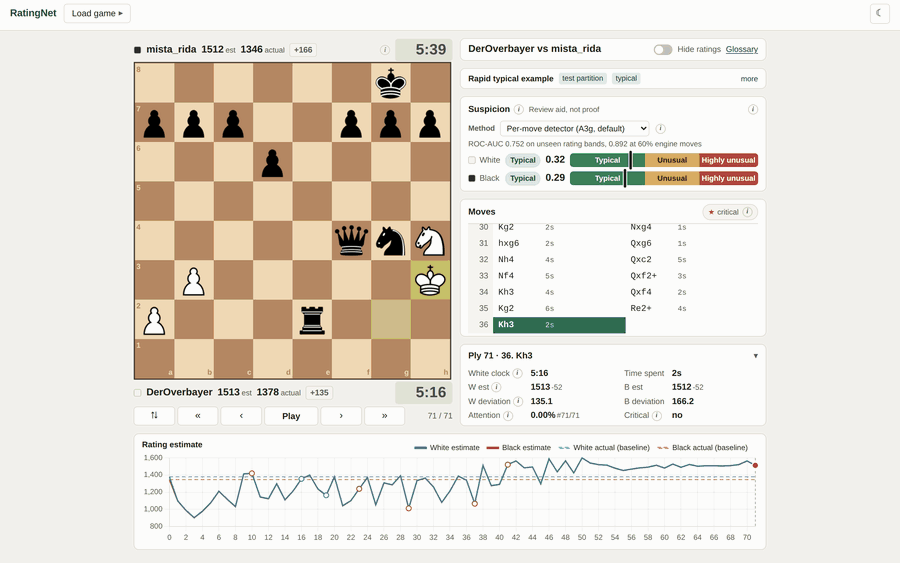
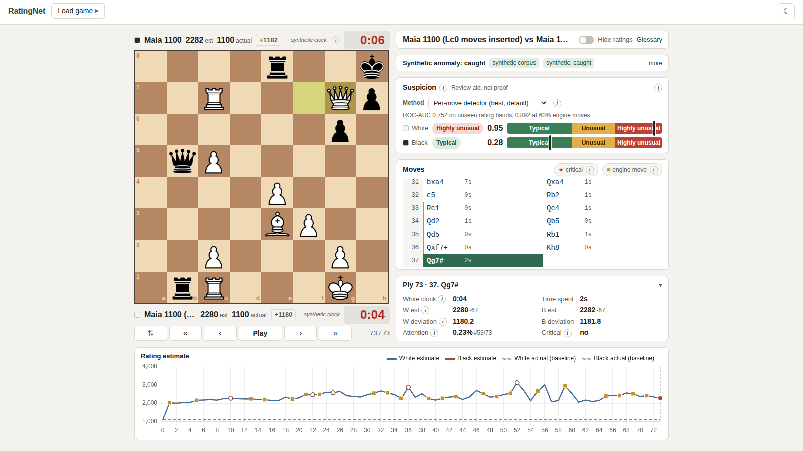
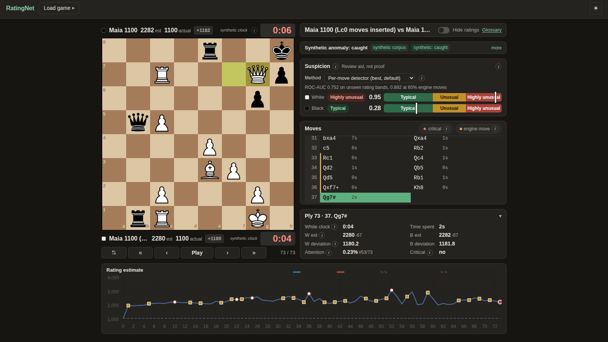
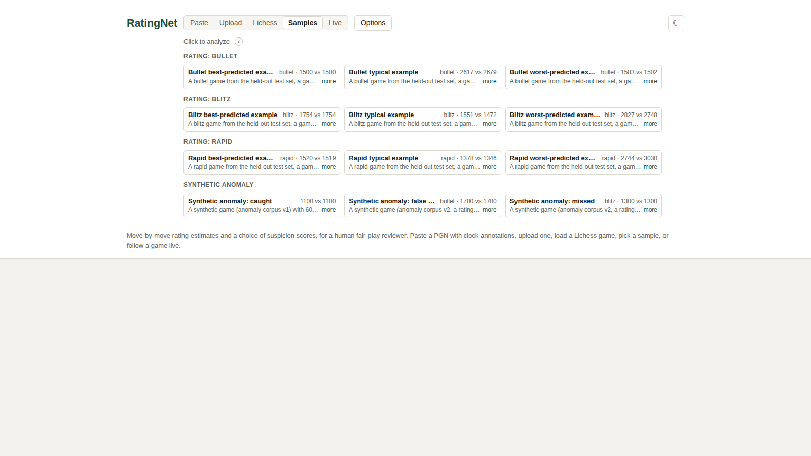
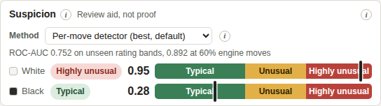
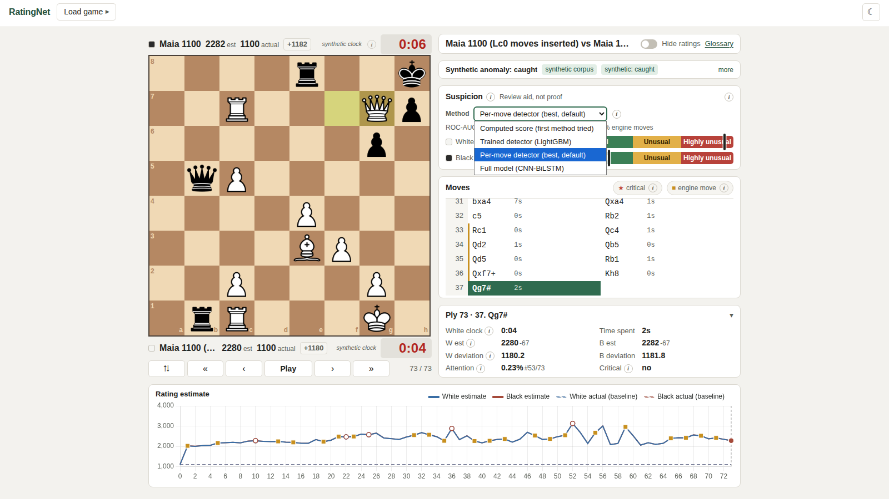

# Real-Time Chess Skill Estimation and Anomaly Detection Using an Attention-Augmented CNN-BiLSTM

BS Computer Science thesis (Camarines Sur Polytechnic Colleges). This fork
extends the CNN-BiLSTM rating-estimation baseline of Omori & Tadepalli (2024)
with a deeper CNN, an attention mechanism, a move-level anomaly-detection
module, and a real-time web prototype for human fair-play review.

The prototype estimates each player's rating move by move from board states
and clock times, and gives each side a suspicion score, from any of four
methods the thesis tried, as a pointer for a human reviewer. It takes a PGN, a
Lichess game ID, a built-in sample game, or a live ongoing Lichess game.

**Based on the baseline paper:** *Chess Rating Estimation from Moves and Clock
Times Using a CNN-LSTM* by Michael Omori and Prasad Tadepalli (Oregon State
University). https://arxiv.org/abs/2409.11506
Manuscript and experimental plan: [J4ve/cs_thesis](https://github.com/J4ve/cs_thesis).

## The app

Following a live Lichess TV game, switching suspicion methods mid-game:





The same view in dark theme, and the sample-game picker:

| Dark theme | Sample games |
| --- | --- |
|  |  |

## What it does

- **Rating estimate per move** (`src/chess_rating_net.py`, `src/attention.py`):
  a CNN-BiLSTM with causal-cumulative Bahdanau attention. The API serves the
  frozen thesis checkpoint: the tuned-attention arm, test MAE 171.92.
- **Suspicion score per side, four selectable methods** (weights in
  `src/models/`). A Method dropdown on the suspicion card switches between
  them for the loaded game without re-running the rating model, and remembers
  the choice. ROC-AUC on synthetic games from rating bands withheld from
  training (from `src/static/suspicion_methods.json`):

  | Method (page label) | Code, thesis arm | Withheld bands | 2% engine moves | 60% engine moves |
  | --- | --- | --- | --- | --- |
  | Computed score (first method tried) | `src/anomaly.py`, S_att | 0.506 | 0.497 | 0.520 |
  | Trained detector (LightGBM) | `src/lgbm_detector.py`, A0g | 0.688 | 0.539 | 0.811 |
  | **Per-move detector (best, default)** | `src/detector.py`, A3g | **0.752** | 0.576 | 0.892 |
  | Full model (CNN-BiLSTM) | `src/cnn_bilstm_detector.py`, A4 | 0.705 | 0.547 | 0.838 |

  

  The Method dropdown open, showing all four choices:

  

- **Typical / Unusual / Highly unusual labels**, from each method's own
  percentile cutoffs over the same 2,822 ordinary held-out test games, per
  time control. A label says how uncommon a score is among ordinary games,
  never that anyone cheated.
- **Critical moves**: per side, the moves ranked highest by attention times
  rating deviation, so a reviewer knows where to look first. This ranking
  does not change with the selected method.
- **Live mode**: follows an ongoing Lichess game (or Lichess TV) move by move
  over Server-Sent Events.
- **Sample games**: held-out test games across time controls, plus synthetic
  caught / false-alarm / missed examples, in one click.

## Quick start (web prototype, local machine)

PyTorch needs Python 3.12 or 3.13. A venv outside the repo keeps its
interpreter symlinks clear of any repo sync tooling.

> `RATINGNET_CHECKPOINT` points at the frozen thesis checkpoint on disk; it
> is read-only and never copied into the repo. See [Weights](#weights) below
> for the alternative of placing the file directly under `models/`.

```bash
python3.12 -m venv ~/venvs/ratingnet-web
source ~/venvs/ratingnet-web/bin/activate

pip install torch --index-url https://download.pytorch.org/whl/cpu
pip install -r requirements.txt

export RATINGNET_CHECKPOINT=/path/to/best_model.pth

python src/api.py
```

The service binds to `http://0.0.0.0:8000` by default (set `PORT` to
override). Open **http://localhost:8000/** in a browser for the web
prototype, or use the API directly:

```bash
curl http://localhost:8000/health

curl -X POST http://localhost:8000/predict/pgn \
  -H "Content-Type: application/json" \
  -d '{"pgn": "[Event \"Demo\"]\n[WhiteElo \"1500\"]\n[BlackElo \"1500\"]\n[TimeControl \"300+0\"]\n\n1. e4 {[%clk 0:05:00]} e5 {[%clk 0:05:00]} *"}'

curl -X POST http://localhost:8000/predict/upload -F "file=@game.pgn"

curl -X POST http://localhost:8000/predict/lichess \
  -H "Content-Type: application/json" \
  -d '{"game_id": "abcd1234"}'
```

## Weights

The rating checkpoint is **not committed**: set `RATINGNET_CHECKPOINT` to its
path, or place it directly at `models/preflight_check_2m/best_model.pth`:

```bash
mkdir -p models/preflight_check_2m
cp /path/to/best_model.pth models/preflight_check_2m/best_model.pth
```

The trained suspicion detectors (per-move, LightGBM, CNN-BiLSTM head) are
small and **are** committed, with their provenance, at `src/models/`. See
[docs/development.md](docs/development.md) for the fallback checkpoint,
submodule use, and the training path.

## Documentation

- [docs/web-prototype.md](docs/web-prototype.md) - the page itself: layout,
  analysis board, suspicion score and labels, sample games, live mode,
  roadmap, vendored libraries.
- [docs/api.md](docs/api.md) - endpoints, every response field, and error
  behaviour.
- [docs/development.md](docs/development.md) - weights, submodule use,
  training path, and the upstream baseline's own README.
- [experiments/detector_parity/](experiments/detector_parity/) - the app's
  per-move detector path reproduces the thesis HPC code to within 6e-07.
- [experiments/method_parity/](experiments/method_parity/) - the same check
  for the LightGBM (4.8e-07) and CNN-BiLSTM (2.6e-05) ports.
- [experiments/method_cutoffs/](experiments/method_cutoffs/) - how every
  method's suspicion cutoffs were computed, with bootstrap CIs.

## Tests

```bash
pytest tests/
```

needs no rating checkpoint and runs in a few seconds; it covers every scoring
path against fixtures from the thesis HPC code, the cutoffs and label logic,
and the method-switch response.

**Regression suite (run after any model, detector or cutoffs change).**
`tests/test_browser_regression.py` loads all 12 bundled samples under all 4
suspicion methods (48 cases) in headless Chrome and checks for console errors,
that the score and label render, and that each score matches its
parity-checked value in `tests/regression/expected_sample_scores.json`. It is
opt-in because it needs the checkpoint, Playwright and a Chrome binary:

```bash
pip install playwright
RATINGNET_BROWSER_REGRESSION=1 \
RATINGNET_CHECKPOINT=/path/to/best_model.pth \
RATINGNET_CHROME=/path/to/chrome \
pytest tests/test_browser_regression.py
```

It starts its own server on a free port (or set `RATINGNET_REGRESSION_URL` to
test a running one); `RATINGNET_CHROME` can be left out if Playwright's own
Chromium is installed (`playwright install chromium`). After a deliberate
change (an arm swap, new cutoffs), regenerate the expected file with
`experiments/method_parity/build_regression_expected.py` (for a new or
re-trained detector, re-run its parity check first so the expected scores
come from the HPC code path) and review the diff.

## Limitations

> **Suspicion score is a supplementary flag, not a verdict.** It is meant to
> help a human fair-play reviewer decide where to look, not to accuse a
> player automatically. See Barnes and Hernandez-Castro (2015) on the
> false-positive risk of single-game move analysis.

- **The trained detectors learned from synthetic games only.** Their measured
  AUCs come from Maia games with inserted engine moves, not from confirmed
  real cheating cases, and all are weak when only a few moves are engine
  moves (0.54 to 0.58 at 2 percent). None of their per-move outputs locate
  the engine moves, so the app does not use them. The four methods often
  disagree on the same game.

> **Mid-game values are provisional.** For an ongoing game (`Result` header
> `*`), Lichess itself delays the export by a few moves, and any suspicion
> score computed before the game ends should be read as provisional: it can
> shift once more moves are known.

- **Every move re-runs the full bidirectional model over the whole prefix.**
  The model's BiLSTM has a backward pass that needs a completed sequence;
  there is no incremental/streaming inference here; scoring ply *t* means
  running the model over plies 1..*t* from scratch. This is fine for the
  batch PGN/Lichess-ID flows in this prototype. Live mode (see [docs/web-prototype.md](docs/web-prototype.md#live-mode))
  works around it by re-running the batch pipeline on the growing prefix
  and taking only the final-ply estimate each time, so the live curve is a
  sequence of independent from-scratch runs, not a true incremental
  inference; it can differ from the full-game curve for the same finished
  game.

> **Self-prediction fallback baselines are close to meaningless.** If neither
> the caller nor the PGN headers supply a baseline rating, the suspicion
> score compares the model's own final-ply prediction against itself. The
> API always reports which baseline source was used
> (`white_baseline_source`/`black_baseline_source`) so this is visible, not
> silent.

## Thesis abstract

This thesis develops a deep-learning system that estimates a chess player's skill move-by-move in real time from board states and clock times, and simultaneously flags moves that deviate suspiciously from the player's established level as possible engine assistance. The system extends the CNN-BiLSTM rating-estimation baseline of Omori and Tadepalli with a deeper convolutional network, an attention mechanism, and a move-level anomaly-detection module, and packages the result as a real-time web prototype for human fair-play review.

## License

This project is licensed under the MIT license - see LICENSE.
